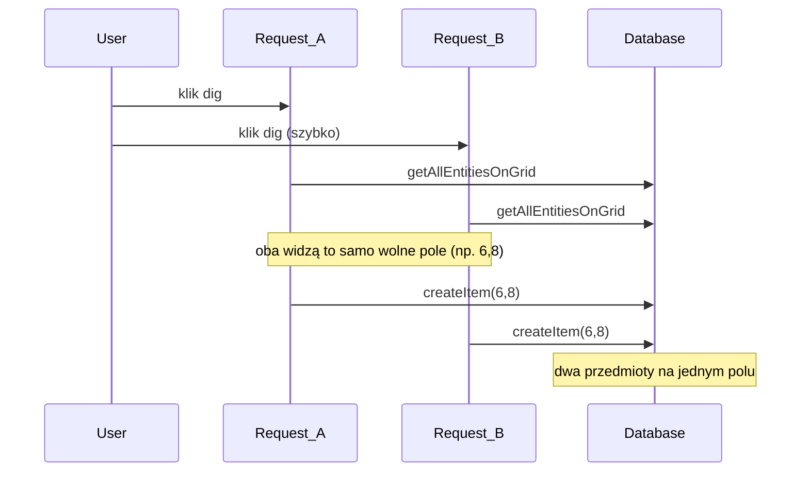

# Naprawa nakładania się przedmiotów przy szybkim kopaniu

## Przyczyna

Obecny flow w [`apps/backend/src/routes/structures.ts`](apps/backend/src/routes/structures.ts) to **dwa oddzielne kroki bez synchronizacji**:



Frontend w [`apps/frontend/src/components/GroundGrid.tsx`](apps/frontend/src/components/GroundGrid.tsx) nie blokuje kolejnych kliknięć — każde wywołuje `dig.mutateAsync()` w osobnym async IIFE, więc requesty lecą równolegle.

W bazie ([`schema.prisma`](apps/backend/src/prisma/schema.prisma)) **nie ma** unikalnego constraintu na `(authorId, x, y)` dla `Item`/`Bug`, więc DB akceptuje duplikat.

Ten sam wzorzec występuje też w:
- [`apps/backend/src/routes/stacks.ts`](apps/backend/src/routes/stacks.ts) — `extractItemFromStack` (pozycja wybierana poza transakcją `takeItemFromStack` / `dissolveStack`)
- [`apps/backend/src/routes/structures.ts`](apps/backend/src/routes/structures.ts) — `extractOccupant`

Warto naprawić wszystkie trzy miejsca jednym mechanizmem.

## Rozwiązanie (backend — źródło prawdy)

### 1. Wspólna blokada siatki per gracz

Nowy helper np. [`apps/backend/src/helpers/gridPlacement.ts`](apps/backend/src/helpers/gridPlacement.ts):

- **`getAllEntitiesOnGridTx(tx, authorId)`** — wariant [`getAllEntitiesOnGrid`](apps/backend/src/helpers/entities.ts) używający klienta transakcyjnego Prisma (te same zapytania co dziś, ale przez `tx`).
- **`findNearestEmptyPositionForAuthor(tx, authorId, near)`** — w transakcji: pobierz encje → `findNearestEmptyPosition(...)` z [`randomPosition.ts`](apps/backend/src/helpers/randomPosition.ts).

Każda operacja umieszczająca encję na siatce owija się w:

```typescript
await prisma.$transaction(async (tx) => {
  await tx.$executeRaw`SELECT pg_advisory_xact_lock(hashtext(${authorId}))`;
  const emptyPosition = await findNearestEmptyPositionForAuthor(tx, authorId, near);
  // ... create/update w tej samej transakcji (tx.item.create / tx.bug.create / tx.bug.update)
});
```

`pg_advisory_xact_lock` jest zwolniony na końcu transakcji — kolejny request gracza zobaczy już zajęte pole i wybierze następne najbliższe.

### 2. Refaktor endpointów

**Dig** — przenieść logikę z handlera do serwisu (np. `digAtHole(authorId, holeId)`):
- walidacja dziury (poza transakcją OK)
- transakcja z lockiem → nearest position → `generateRandomItemType()` → `tx.item.create` / `tx.bug.create`
- handler w route tylko woła serwis i mapuje DTO

**Extract ze stacka** — pozycję wyliczać **wewnątrz** istniejącej transakcji `takeItemFromStack` / `dissolveStack` (albo jednej nadrzędnej transakcji z lockiem), nie wcześniej w route.

**Extract żuka z domku** — `updateBug` w transakcji z lockiem, po świeżym odczycie siatki.

### 3. Czego nie robić

- **Sam frontend (`isPending`)** — niewystarczający (dwa kliki w jednym ticku, wiele kart, race nadal możliwy).
- **Unique index na `(authorId, x, y)` per tabela** — nie chroni przed kolizją między `Item` a `Bug` na tym samym polu; wymagałby retry i skomplikowanej migracji.
- **In-memory mutex w Node** — nie działa przy wielu instancjach backendu.

## Opcjonalna warstwa UX (frontend)

W [`GroundGrid.tsx`](apps/frontend/src/components/GroundGrid.tsx) — prosty guard przy kopaniu:

```typescript
const diggingRef = useRef(false);
if (diggingRef.current) return;
diggingRef.current = true;
try { await dig.mutateAsync(...) } finally { diggingRef.current = false; }
```

To ogranicza spam requestów, ale **backend fix jest obowiązkowy**.

Analogiczny guard można dodać dla stack extract / beetle house extract (opcjonalnie).

## Weryfikacja

- Ręcznie: szybkie wielokrotne kliknięcie dziury → każdy nowy przedmiot na **różnym**, najbliższym wolnym polu.
- Ręcznie: to samo dla stack extract i wypuszczania żuka.
- `npx tsc --noEmit` w backendzie po refaktorze.

## Zakres plików

| Plik | Zmiana |
|------|--------|
| `apps/backend/src/helpers/gridPlacement.ts` | **nowy** — lock + nearest position w transakcji |
| `apps/backend/src/helpers/entities.ts` | opcjonalnie wyeksportować logikę mapowania encji dla `tx` |
| `apps/backend/src/services/itemsService.ts` | transakcyjne warianty extract/dig jeśli potrzebne |
| `apps/backend/src/services/bugsService.ts` | transakcyjny extract occupant |
| `apps/backend/src/routes/structures.ts` | cienkie handlery wołające serwisy |
| `apps/backend/src/routes/stacks.ts` | j.w. |
| `apps/frontend/src/components/GroundGrid.tsx` | opcjonalny ref-guard przy dig |
